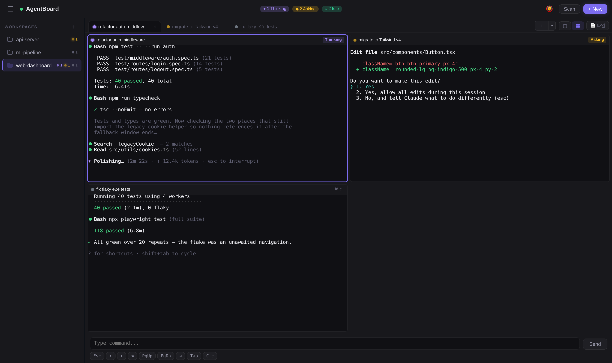
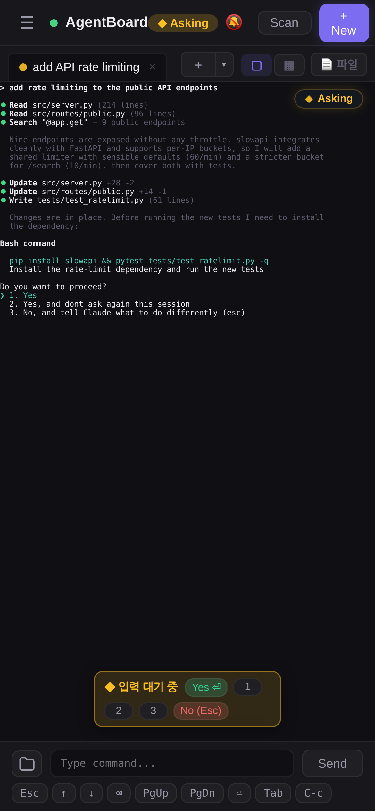
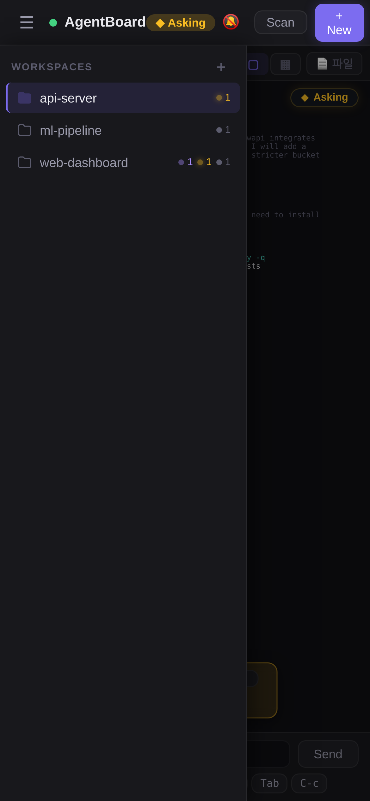

<div align="right">

[English](README.md) · **한국어**

</div>

<h1 align="center">AgentBoard</h1>

<p align="center">
  <strong>여러 AI 코딩 에이전트를 어디서든 — 심지어 휴대폰에서도.</strong>
</p>

<p align="center">
  
  
  
  
  
  
  
  
</p>

---

AgentBoard는 다수의 AI 코딩 에이전트를 — 원하는 만큼 여러 대의 머신에 걸쳐 — 동시에 굴리는 브라우저 기반 통합 대시보드입니다. Claude Code, Codex, Aider 같은 셸 에이전트를 각자의 `tmux` 세션에 띄우고, 한 번의 탭으로 전환하며, 노트북·태블릿·폰을 오가더라도 정확히 같은 자리에서 이어서 작업하세요. 여러 PC(심지어 NAT 뒤)에서 도는 세션이 하나의 대시보드로 모입니다.

> 에이전트 하나로는 부족해진 그 순간 — 그리고 머신 하나로는 부족해진 그 순간을 위해 만들어졌습니다.

<p align="center">
  
</p>
<p align="center">
  
  &nbsp;
  
</p>

## 왜 AgentBoard인가

요즘 코딩 에이전트는 **몇 초가 아니라 몇 분, 몇 시간** 돌려야 진가를 발휘합니다. 그러다 보면 동시에 3개, 5개, 10개씩 굴리게 되고, `tmux`만으로는 모바일에서 금방 한계가 옵니다. AgentBoard는 `tmux`를 깔끔한 대시보드로 감싸서 다음을 제공합니다:

- **모바일에서 그냥 잘 됩니다.** 진짜 터치 스크롤과 모멘텀, 깨지지 않는 제스처, 함정 없는 핀치. 에뮬레이터가 아니라 실기기에서 빌드하고 튜닝했습니다.
- **에이전트가 뭘 하고 있는지 보여줍니다.** 세션마다 터미널 출력에서 추출한 `idle` / `working` / `waiting` 상태 배지가 표시됩니다.
- **상태를 잃지 않습니다.** 세션은 `tmux`에 살아 있어 페이지 새로고침, 서버 재시작, 네트워크 끊김에도 그대로 유지됩니다.
- **솔직히 빠릅니다.** 보고 있는 세션은 80 ms 갱신, 나머지는 2 s. 적응형이라 낭비가 없습니다.

## 이런 순간을 위해

- **장시간 리팩토링** — 데스크에서 에이전트 띄워놓고, 카페에서 폰으로 진행 확인하고, 확인 메시지 뜨면 `y` 한 번 탭.
- **병렬 코딩** — 세 에이전트가 세 브랜치에서 일하는 동안 대시보드 하나로 관제. 컨텍스트 전환 비용 0.
- **자기 자신과 페어프로그래밍** — 같은 `tmux` 상태를 네트워크 안의 어떤 디바이스에서든 실시간으로.
- **태블릿 우선 개발** — 파일 브라우저, 코드 에디터, PDF 뷰어, 라이브 터미널을 한 탭에서.

## 기능

| | |
|---|---|
| **멀티 세션 터미널** | 무제한 `tmux` 세션 spawn / kill / 이름 변경 / 전환 |
| **멀티 머신** | 여러 PC의 세션을 하나의 대시보드로 통합 — 원격 에이전트가 아웃바운드로 접속하므로 NAT·방화벽 무관 |
| **모바일 우선 UI** | 커스텀 터치 핸들러 — 모멘텀 스크롤, 하단 이동 버튼, 화면 키(PgUp/PgDn, ⌫), 키보드 친화적 입력 |
| **실시간 상태 감지** | 세션별 `idle` / `working` / `waiting-for-input` 배지 |
| **푸시 알림** | 세션이 `waiting`·`completed`로 바뀌면 Web Push로 OS 알림 — iOS(설치형 PWA)에서도 동작 |
| **적응형 폴링** | 활성 세션 80 ms, 백그라운드 세션 2 s |
| **파일 브라우저 + 에디터** | CodeMirror 6 기반, 13개 이상 언어 문법 강조, git diff 뷰 포함 |
| **마크다운 + KaTeX** | 노션 스타일 렌더 뷰, 클릭 가능한 체크박스, sanitize 처리, 수식 클라이언트 렌더링 |
| **Jupyter 노트북** | 읽기 전용 `.ipynb` 뷰어 — 셀 렌더링, 코드 문법 강조, 이미지·표·에러 출력 |
| **PDF·이미지 뷰어** | PDF 줌 (50–300%)·너비 맞춤, 이미지 팬/줌, 모두 lazy load |
| **쿠키 인증** | 단일 비밀번호, HMAC-SHA256 서명, IP별 로그인 제한 |
| **Cloudflare 터널 (옵션)** | 환경변수 하나로 외부 공개 |
| **죽지 않는 세션** | `tmux` 기반이라 새로고침·재시작·연결 끊김에도 살아남음 |

## 빠른 시작

### Docker (가장 빠름)

```bash
git clone https://github.com/ralbu85/AgentBoard.git
cd AgentBoard
DASHBOARD_PASSWORD=비밀번호설정 docker compose up -d --build
```

`http://localhost:3002` 접속 후 로그인. 세션은 기본으로 `bash`를 실행합니다 —
이미지에 AI CLI가 들어 있지 않으므로 필요한 도구를 설치하거나
(`docker compose exec agentboard npm install -g @anthropic-ai/claude-code`)
이미지를 확장하세요. 프로젝트 폴더는 `AGENTBOARD_WORKSPACE=/path/to/projects`로 마운트합니다.

### 수동 설치 (베어메탈)

사전 요구사항: `tmux`, Python 3.12, Node 20+.

```bash
git clone https://github.com/ralbu85/AgentBoard.git
cd AgentBoard

python3.12 -m venv backend/.venv
backend/.venv/bin/pip install -r backend/requirements.txt
(cd frontend && npm install)

echo "DASHBOARD_PASSWORD=비밀번호설정" > .env

./deploy.sh        # 프론트 빌드 + 서버 기동 + /api/health 대기
```

브라우저에서 `http://localhost:3002` 접속 → 로그인 → **+ New** 클릭하면 에이전트가 뜹니다.
서버는 기본으로 루프백에만 바인드됩니다 — LAN에서 접속하려면 `.env`에
`AGENTBOARD_HOST=0.0.0.0`을 넣거나, HTTPS가 필요하면 앞단에 리버스 프록시(nginx/Caddy)를 두세요.

### 머신 추가하기 (선택)

추가하는 PC마다 경량 에이전트가 허브로 **아웃바운드** 접속합니다 — NAT·방화벽
뒤의 머신도 SSH·포트포워딩 없이 그냥 붙습니다. 각 원격 PC에서:

```bash
git clone https://github.com/ralbu85/AgentBoard.git && cd AgentBoard
python3.12 -m venv backend/.venv
backend/.venv/bin/pip install -r backend/requirements.txt   # tmux도 설치 필요

export AGENT_HUB_URL=wss://허브주소/agent-ws     # ws://는 AGENT_INSECURE=1 필요
export AGENT_TOKEN=<허브의 AGENT_TOKEN>          # 기본값은 허브 인증 토큰
export AGENT_HOST_LABEL="연구실 PC"              # 대시보드 표시 이름 (선택)
agent/start-agent.sh
```

몇 초 안에 대시보드에 머신이 나타나고, 세션은 `office:1`, `office:2`처럼
표시되며 spawn·kill·입력·푸시 알림까지 로컬 세션과 동일하게 동작합니다.
운영 환경에서는 반드시 `wss://`를 쓰세요 — 토큰이 셸 접근 권한이므로
평문으로 보내면 안 됩니다.

## 아키텍처

```
   브라우저 (xterm.js + React)
            │
            │  HTTPS / WSS
            ▼
     nginx :12019
            │
            ▼
     uvicorn :3002 ──── pipe-pane FIFO
            │           capture-pane 폴링
            ▼
       tmux 세션
```

| 레이어 | 스택 |
|---|---|
| 프론트엔드 | React 19, xterm.js 5.5, Zustand, Vite, CodeMirror 6 |
| 백엔드 | FastAPI, asyncio, async subprocess로 `tmux` 호출 |
| 인증 | HMAC-SHA256 서명 쿠키 |
| 프록시 | nginx (옵션, HTTPS 권장 시) |

## API

### REST

| 메서드 | 경로 | 본문 |
|---|---|---|
| `POST` | `/api/login` | `{pw}` |
| `GET`  | `/api/workers` | — |
| `POST` | `/api/spawn` | `{cwd, cmd}` |
| `POST` | `/api/kill` | `{id}` |
| `POST` | `/api/remove` | `{id}` |
| `POST` | `/api/input` | `{id, text}` |
| `POST` | `/api/key` | `{id, key}` |
| `GET`  | `/api/browse?path=` | 디렉토리 목록 |
| `GET`  | `/api/files?path=` | 파일 메타데이터 |
| `GET`  | `/api/file?path=` | 파일 읽기 |
| `POST` | `/api/file` | `{path, content}` 쓰기 |
| `GET`  | `/api/health` | 상태 확인 |

### WebSocket `/ws`

- **Client → Server:** `resize`, `active`, `resync`, `title`, `key`, `terminal-input`, `input`
- **Server → Client:** `spawned`, `snapshot`, `screen`, `stream`, `status`, `cwd`, `aiState`, `info`, `title`, `titles`

## 프로젝트 구조

```
backend/
  main.py            FastAPI 앱, 라이프사이클, 정적 파일 서빙
  config.py          .env 로딩, 인증 토큰, 프로젝트 루트
  auth.py            HMAC-SHA256 쿠키 인증
  sessions.py        SessionStore: tmux spawn / kill / 복구
  streamer.py        pipe-pane FIFO + capture-pane 폴링
  state_detector.py  idle / working / waiting 휴리스틱
  tmux.py            async tmux 래퍼
  ws.py              WebSocket 라우팅 + 브로드캐스트
  routes_session.py  REST: login, workers, spawn, kill, input
  routes_file.py     REST: browse, files, read / write
  tunnel.py          Cloudflare 터널 (옵션)

frontend/
  src/
    App.tsx                       루트 + 로그인 플로우
    store.ts                      Zustand 상태
    ws.ts                         WebSocket 싱글톤
    api.ts                        REST 래퍼
    components/Terminal/          xterm.js 라이프사이클, 모바일 스크롤
    components/Sidebar/           세션 목록, 모바일 오버레이
    components/Viewer/            분할 레이아웃, 코드 에디터, 파일 콘텐츠
    components/SpawnModal/        새 세션 다이얼로그
    components/FilePanel.tsx      파일 브라우저
    components/PdfViewer.tsx      PDF 렌더링
    components/Header.tsx         상태바, + New 버튼
    components/Login.tsx          비밀번호 로그인
    components/Toaster.tsx        토스트 알림
```

## 컨트리뷰터를 위한 메모

이미 누군가가 발견한 비자명한 결정들:

- **정적 자산은 `no-cache`로 서빙됩니다.** 빌드 결과물은 고정 파일명(`app.js`, `index.css`)을 쓰고, 캐시 무효화는 `deploy.sh`가 주입하는 `?v=<timestamp>` 쿼리로 처리합니다. 클라이언트에 `setTimeout` 자동 새로고침을 **절대** 추가하지 마세요 — 느린 모바일에서 무한 루프에 빠집니다.
- **xterm.js 네이티브 터치 핸들러는 비활성화**되어 있습니다 (`.xterm*`에 `pointer-events: none`). 모바일 스크롤은 `.xterm-wrap`의 커스텀 핸들러가 담당합니다. Playwright의 CDP 터치 방향은 실기기와 **반대**이므로 에뮬레이터 결과보다 실기기 피드백을 신뢰하세요.
- **클라이언트는 raw 스트림을 받지 않습니다.** pipe-pane 출력에 들어 있는 이스케이프 시퀀스가 스크롤백을 망가뜨리기 때문입니다. 클라이언트는 `writeScreen` (in-place capture-pane)과 세션 전환 시 1회성 `writeSnapshot`만 받습니다.
- **항상 프로젝트 루트에서 실행하세요.** `start.sh`와 `deploy.sh`가 처리해 줍니다 — 먼저 `cd`해야 `backend.main` 모듈이 풀립니다.

## 라이선스

[GNU AGPL-3.0](LICENSE) © 2026 Jihwan (James) Lee.

자유롭게 사용·수정·자가호스팅할 수 있습니다. AGPL의 네트워크 조항에 따라,
수정한 버전을 네트워크 서비스로 운영하는 경우 이용자에게 수정된 소스를 제공해야
합니다. AGPL 의무 없이 쓰려는 상업 라이선스가 필요하면 저작권자에게 문의하세요.
